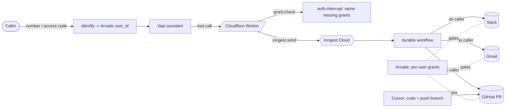

# 📞 voice-to-pr — Call your codebase, and it acts *as you*

**Call a number, say what you want, and an agent acts across your tools — opening a PR, posting to Slack, emailing you — all scoped to *your* permissions, enforced per action by Arcade.** Call as someone else and you get different power.

The wow is the phone call. The point is **per-user authorization**: the agent's reach is the intersection of "what the agent can do" and "what *that caller* is allowed to do" — something a shared bot token fundamentally can't do.

| Layer | Tool | Role |
| --- | --- | --- |
| 🎙️ Voice | **[Vapi](https://vapi.ai)** | Answers the call, identifies the caller, turns intent into tool calls. |
| ⛓️ Durable orchestration | **[Inngest](https://www.inngest.com)** | Runs the multi-step workflow; sleeps/polls while the agent works; retries each step. |
| 🤖 Coding | **[Cursor Cloud Agents](https://cursor.com/docs/cloud-agent/api/endpoints)** | Writes the code and pushes a branch. |
| 🔐 **Per-user authorization** | **[Arcade](https://arcade.dev)** | **Every action (open the PR, post to Slack, send/read Gmail) runs as the *caller*, via their OAuth grant — no bot tokens.** |
| ☁️ Host | **[Cloudflare Workers](https://workers.cloudflare.com)** | Always-on public endpoint, `wrangler deploy`. |

Cursor opens *code*; Arcade governs the *human-attributed actions* (PR, Slack, Gmail) — complementary, not redundant.

---

## Why this is a strong Arcade demo
- **Two callers, different power, visible consequences.** Same request: an authorized caller gets a PR opened as them + Slack + email; an unauthorized caller gets *none of it* — the agent says exactly what they must connect. Enforced by Arcade at runtime.
- **Breadth + managed auth.** One request fans across Slack, GitHub, and Gmail with zero token handling in the app. Swap in any of Arcade's toolkits the same way.
- **A live auth-interrupt.** When a caller lacks a grant, the agent surfaces it mid-call ("connect GitHub and Gmail") instead of failing silently.
- **Read, not just write.** `brief_me` reads the caller's *own* inbox + open PRs — pure per-user Arcade, no coding agent involved.

---

## Architecture



---

## The two demo beats

**1. Same agent, different power.** Alice calls, gives her access code, says "fix the footer typo, tell the team." The agent opens the PR **as Alice**, posts Slack **as Alice**, emails Alice — recap names each action. Bob calls with the same ask but hasn't connected GitHub/Gmail: the agent opens nothing on his behalf and tells him live what to connect. (Verified: an authorized caller's PR is authored by *their* GitHub login; an unauthorized caller gets every action denied.)

**2. "Brief me" (pure Arcade read, no Cursor).** "What's on my plate?" -> the agent reads *your* recent emails and *your* open PRs via Arcade. A different caller sees their own — or nothing if they haven't connected.

---

## Contextual Access (the governance layer)

On top of per-user OAuth, Arcade's Contextual Access (CATE) hooks run *your* policy inline on every tool call — no changes to the tools or the agent. This demo ships all three, served by the same Worker ([src/cate.ts](voice-to-pr/src/cate.ts), routes `/hooks/access|pre|post`):

- **Access** — read-only callers (`READONLY_USERS`) can't even *see* write tools (Slack/GitHub/Gmail sends); they keep the read tools.
- **Pre-execution** — PRs only on `ALLOWED_GITHUB_OWNERS`; email only to `ALLOWED_EMAIL_DOMAIN`. Anything else is blocked with a reason the agent speaks.
- **Post-execution** — secrets/PII (OTP codes, API keys, SSNs) are redacted from tool output before they reach the agent — so nothing sensitive is read aloud over the phone.

Wire it with the Arcade admin API (`/v1/admin/plugins` — register a webhook plugin pointing at `/hooks/*`, then set it `active`) or the dashboard. Verified live: `Github.CreatePullRequest` on a non-allowlisted owner returns `CONTEXT_DENIED` with the policy reason, *before* any GitHub call. (Set `CATE_HOOK_TOKEN` to authenticate Arcade -> your hooks in production.)

## Tools the assistant exposes
- `submit_coding_task` — code change -> Cursor branch -> **Arcade opens the PR as the caller** + Slack + Gmail, each per-user.
- `brief_me` — read the caller's own Gmail + open PRs (per-user, read-only).

Both accept an `access_code`; the caller is mapped to an Arcade `user_id` (see Identity).

---

## Identity (who is the caller)
`CALLER_MAP` (JSON) maps a phone number (E.164) **or** a spoken access code to an Arcade `user_id`:

```json
{ "+15551234567": "alice@acme.com", "4242": "alice@acme.com", "1337": "bob@acme.com" }
```

Vapi gives the caller's number on phone calls; the access code works on web calls too. Unmapped callers fall back to a default. Caller-ID is spoofable, so the access code (or a signed JWT / verified identity) is the real gate before granting permissions.

---

## Quickstart (mock mode, no accounts)
Requires Node >= 20.6.

```bash
npm install
cp .env.example .env          # mock mode is the default
npm run dev                   # terminal 1: server
npm run inngest               # terminal 2: Inngest dev dashboard
npm run simulate -- "Fix the off-by-one in search pagination"   # terminal 3
```

## Going live (bring your own keys)
Each integration flips mock -> live when its key is present in `.env`. Per-user auth setup:

```bash
# 1. Keys: ARCADE_API_KEY, ARCADE_USER_ID, CURSOR_API_KEY, VAPI_PRIVATE_KEY, VAPI_PUBLIC_KEY (+ INNGEST_DEV=1 local)
# 2. Map callers to Arcade users:  CALLER_MAP={"4242":"alice@acme.com","1337":"bob@acme.com"}
# 3. Each user authorizes the tools once (prints links for anything ungranted):
npm run authorize             # Slack, GitHub (create + list PRs), Gmail (send + list)
```

The demo's punch is proportional to how *differently* your two users are authorized.

## Deploy to Cloudflare Workers
```bash
# Secrets (Inngest Cloud keys from the dashboard, plus your tool keys):
npx wrangler secret put ARCADE_API_KEY        # + ARCADE_USER_ID, CURSOR_API_KEY,
                                              #   INNGEST_EVENT_KEY, INNGEST_SIGNING_KEY,
                                              #   VAPI_PRIVATE_KEY, VAPI_PUBLIC_KEY,
                                              #   VAPI_ASSISTANT_ID, CALLER_MAP
npm run deploy                                # wrangler deploy (do NOT set INNGEST_DEV)
curl -X PUT https://<your-worker>.workers.dev/api/inngest   # sync with Inngest Cloud
# point PUBLIC_URL at the Worker, then:
npm run create-assistant                      # upserts the Vapi assistant
```

## Talk to it (voice)
- **Dashboard:** open the assistant -> Talk to Assistant (browser mic).
- **Web button:** `https://<your-worker>.workers.dev/call` — tap the mic.
- **Phone:** provision a free Vapi number and attach the assistant, then call it:

```bash
curl -X POST https://api.vapi.ai/phone-number \
  -H "Authorization: Bearer $VAPI_PRIVATE_KEY" -H "Content-Type: application/json" \
  -d '{"provider":"vapi","assistantId":"<id>","numberDesiredAreaCode":"580"}'
```

---

## Project tour
```
voice-to-pr/
├── src/
│   ├── app.ts                  # Hono: webhook routes both tools; synchronous grant-check (auth-interrupt)
│   ├── identity.ts             # caller number / access code -> Arcade user_id (CALLER_MAP)
│   ├── inngest/functions.ts    # ⭐ durable fan-out: Slack + GitHub PR + Gmail, all per-user, + governance recap
│   ├── integrations/
│   │   ├── arcade.ts           # per-user Slack/GitHub/Gmail (write + read) + grant-check
│   │   └── cursor.ts           # launch agent (autoCreatePR:false -> Arcade opens the PR)
│   ├── call-page.ts            # click-to-talk web demo
│   ├── server.ts / worker.ts   # Node + Cloudflare Workers entrypoints
│   └── config.ts / vapi.ts
├── assistant/vapi-assistant.json  # assistant + submit_coding_task + brief_me
└── scripts/                    # simulate-call · create-assistant (upsert) · authorize
```

The heart is `src/inngest/functions.ts`: every side effect goes through a `runStep` that records "did" vs "denied (needs auth)" so the recap shows exactly what ran, as whom.

---

## Notes & caveats
- **Cursor pushes the branch (service cred); Arcade opens the PR as the caller** — so the PR is attributed to the human, and an unauthorized caller can't open one.
- **Two real users** with genuinely different grants make the divergence land; one fully authorized + one unauthorized is the minimum.
- **Caller-ID is spoofable** — gate real permissions on the access code / a verified identity, not the number alone.
- Local uses the Inngest dev server (`INNGEST_DEV=1`); production uses Inngest Cloud.

MIT licensed.
