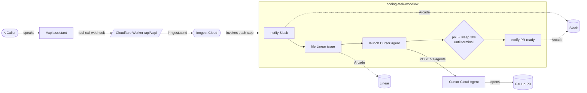

# 📞 voice-to-pr — Call your codebase

**Pick up the phone, describe a bug, hang up. A few minutes later a pull request is waiting in Slack.**

A small, readable, **deployable** example that wires four best-in-class pieces of the 2026 agent stack into one demo — running on Cloudflare Workers.

| Layer | Tool | Role |
| --- | --- | --- |
| 🎙️ Voice front door | **[Vapi](https://vapi.ai)** | Answers the call, transcribes intent, calls one tool: `submit_coding_task`. |
| ⛓️ Durable orchestration | **[Inngest](https://www.inngest.com)** | Runs the multi-step workflow, sleeps/polls while the agent works, retries every step, survives restarts. |
| 🤖 The coding agent | **[Cursor Cloud Agents](https://cursor.com/docs/cloud-agent/api/endpoints)** | Actually edits the repo and opens the PR. |
| 🔐 Authenticated actions | **[Arcade](https://arcade.dev)** | Files the Linear issue and posts to Slack **as a real user**, via per-user OAuth — no shared bot tokens. |
| ☁️ Host | **[Cloudflare Workers](https://workers.cloudflare.com)** | Always-on public endpoint, deployed with `wrangler deploy`. |

> Runs locally in **mock mode with zero accounts**, locally **live** with your keys, and **deploys to Cloudflare Workers** for a real always-on URL. It's a bring-your-own-keys template: anyone with their own keys can run or deploy it.

---

## Why this is a good demo

- **The "wow" is real**: talking to a phone number and getting a PR back lands every time.
- **It shows why durable execution matters.** A coding agent can run for minutes. Inngest `step.sleep`s between polls so you burn zero compute while waiting, and a flaky Slack post never re-triggers the expensive agent. On Workers this is *ideal* — each step is a sub-second invocation and the 30-minute wait lives on Inngest's side.
- **It shows what Arcade is _for_.** The agent's side effects (Linear, Slack) execute scoped to the caller's own OAuth grant — multi-tenant-safe by construction. Swap in any Arcade toolkit without touching auth code.
- **It mirrors Cursor's own pitch** ("a Linear ticket triggers a cloud agent") generalized to **"a phone call triggers a cloud agent."**

---

## Architecture



The same Hono app runs locally on Node (`@hono/node-server`) and on Cloudflare Workers. Locally it uses the **Inngest dev server**; in production it uses **Inngest Cloud**.

---

## Quickstart (mock mode, no accounts)

Requires Node ≥ 20.6.

```bash
npm install
cp .env.example .env          # mock mode is the default
npm run dev                   # terminal 1: the server
npm run inngest               # terminal 2: Inngest dev dashboard (http://localhost:8288)
npm run simulate -- "Fix the off-by-one in search pagination"   # terminal 3
```

In mock mode the "Cursor agent" reports `RUNNING` for a couple of polls then `FINISHED` with a fake PR URL, so you see the durable `step.sleep` loop without spending a cent.

---

## Bring your own keys (local live)

Each integration flips mock → live the moment its key is present in `.env`.

| Var | What | Where |
| --- | --- | --- |
| `ARCADE_API_KEY` | Arcade tool calls (Slack + Linear) | <https://docs.arcade.dev/en/get-started/setup/api-keys> |
| `ARCADE_USER_ID` | The user whose OAuth the actions run under | your email / stable id |
| `CURSOR_API_KEY` | Launch Cloud Agents | Cursor Dashboard → API Keys |
| `DEFAULT_REPO_URL` | Repo the agent edits (must be authorized for the Cursor GitHub app) | a GitHub repo URL |
| `VAPI_PRIVATE_KEY` | Create the assistant via API | Vapi dashboard |
| `INNGEST_DEV=1` | Use the local Inngest dev server | keep for local dev |

```bash
npm run authorize            # one-time: approve Slack + Linear OAuth for ARCADE_USER_ID
npm run dev                  # + npm run inngest in another terminal
npm run simulate -- "Add a CONTRIBUTING.md"
```

To exercise Vapi locally, expose the server with `npm run tunnel` (cloudflared), set `PUBLIC_URL` to the printed URL, then `npm run create-assistant`. **For production, skip the tunnel — deploy to Workers instead (below).**

---

## Deploy to Cloudflare Workers (real, always-on)

No tunnel needed — the Worker has a public URL, and **Inngest Cloud** drives the durable workflow.

```bash
# 1. Inngest Cloud keys (from the Inngest dashboard) + your other keys, as Worker secrets:
npx wrangler secret put ARCADE_API_KEY
npx wrangler secret put ARCADE_USER_ID
npx wrangler secret put CURSOR_API_KEY
npx wrangler secret put INNGEST_EVENT_KEY      # sends events to Inngest Cloud
npx wrangler secret put INNGEST_SIGNING_KEY    # verifies Inngest -> Worker
npx wrangler secret put VAPI_PRIVATE_KEY        # optional

# 2. Deploy (do NOT set INNGEST_DEV in prod -> Inngest Cloud mode)
npm run deploy                                  # wrangler deploy

# 3. Register the app with Inngest Cloud
curl -X PUT https://<your-worker>.workers.dev/api/inngest

# 4. Point Vapi at the Worker
#    set PUBLIC_URL=https://<your-worker>.workers.dev in .env, then:
npm run create-assistant
```

Non-secret config (`DEFAULT_REPO_URL`, `SLACK_CHANNEL`, `LINEAR_TEAM`) lives in `wrangler.jsonc` `vars`. The `nodejs_compat_populate_process_env` flag exposes secrets+vars on `process.env`, so the same config code works on Node and Workers.

---

## Project tour

```
voice-to-pr/
├── src/
│   ├── app.ts                  # Hono app (routes) — runs on Node AND Workers
│   ├── server.ts               # Node entry (@hono/node-server) for local dev
│   ├── worker.ts               # Cloudflare Workers entry (export default app)
│   ├── vapi.ts                 # parse tool-calls, build the { results: [...] } reply
│   ├── config.ts               # lazy env config (Workers-safe) + mock detection
│   ├── inngest/
│   │   ├── client.ts           # Inngest client (dev server vs Cloud via isDev)
│   │   └── functions.ts        # ⭐ the durable coding-task workflow
│   └── integrations/
│       ├── cursor.ts           # launch agent + poll run (raw fetch, mock fallback)
│       └── arcade.ts           # authorize+execute Slack/Linear (mock fallback)
├── assistant/vapi-assistant.json # Vapi assistant + tool definition
├── scripts/                    # simulate-call · create-assistant · authorize
└── wrangler.jsonc              # Cloudflare Workers config
```

The heart is `src/inngest/functions.ts`. The poll loop is the part worth reading:

```ts
let run = await step.run("poll-0", () => getCursorRun(agent.agentId, agent.runId));
let attempt = 0;
while (!isTerminal(run.status) && attempt < MAX_POLLS) {
  await step.sleep(`wait-${attempt}`, "30s");        // zero compute while we wait
  attempt += 1;
  run = await step.run(`poll-${attempt}`, () => getCursorRun(agent.agentId, agent.runId));
}
```

Arcade calls are best-effort, and a missing OAuth grant is made **non-retriable** so it skips instantly instead of stalling the (critical) agent launch.

---

## Demo script (≈90 seconds)

1. "Voice AI is exploding and everyone's building coding agents. Let's connect them — production-shaped, not a happy-path script."
2. Call the number (or `npm run simulate`). Say: *"There's a typo in the landing page footer, fix it."*
3. The assistant reads back a tracking id. Hang up.
4. Open the Inngest dashboard: show the steps, the `30s` sleeps, the poll loop. "It's durable — if this rebooted, the run resumes."
5. Show the Slack message land with the PR link. "And that Slack post + Linear issue went out under a real user's OAuth, through Arcade — not a bot token with the keys to the kingdom."

---

## Notes & caveats

- **Cursor repo access**: the agent only works on repos the Cursor GitHub app can access. A brand-new repo needs the app granted access first.
- **Inngest**: local uses the dev server (`INNGEST_DEV=1`); production uses Inngest Cloud (event + signing keys). Cloud Agents API v1 webhooks are "coming soon" — that's why we poll durably. When they ship, swap the poll loop for a single `step.waitForEvent`.
- **Arcade tool schemas** (`Slack.SendMessage`, `Linear.CreateIssue`) are centralized in `src/integrations/arcade.ts`.
- Example-grade: add Vapi webhook signature verification (`VAPI_SERVER_SECRET`) and persistence before real production.

MIT licensed — do whatever helps you ship.
